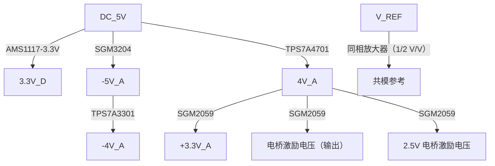

<!------------------------------------------------------------------------
SPDX-License-Identifier: CC-BY-SA-4.0
Copyright (C) 2026 [Your Name/Organization]

This work is licensed under the Creative Commons Attribution-ShareAlike 4.0 International License. 
To view a copy of this license, visit http://creativecommons.org/licenses/by-sa/4.0/.
------------------------------------------------------------------------->

<!-- Assisted-by: DeepSeek - 文档框架 -->

# E4 – 硬件架构文档

| 文档编号 | E4-HAD-001 | 版本 | V1.0 |
|---------|-----------|------|------|
| 项目名称 | 创新创业实践课程设计 – E4 应变采集 | 日期 | 2026-05-28 |
| 起草人   | EERNINUO | 状态 | 设计中 |

## 1. 概述
E4 模块基于 **STM32G473** 实现 4 通道应变信号同步采集。外部应变片（半桥配置）输出的微弱差分信号经 **仪表放大器预放大 → 衰减匹配 → 4阶有源低通滤波** 后，送入 MCU 内置 ADC（12位，差分输入）。模块支持 **外部事件触发** 实现同步采集，采集数据通过 **USB 虚拟串口** 上传至 PC，并可选 **QSPI Flash** 存储标定参数、**SRAM** 缓存高速数据。

## 2. 系统框图

## 3. 模块划分与功能定义

### 3.1 模拟前端（AFE）
| 级 | 功能 | 关键要求 | 增益(V/V) | 初步选型 |
|----|------|---------|-----------|----------|
| 0 | 应变片 | 激励电压 2.5V，差分输出 mV 级 | - | 350Ω 应变片 + 精密电阻 |
| 1 | 仪表放大器 | 共模抑制比 > 80dB，增益 4 倍 | 4 | INA828 |
| 2 | 4阶有源低通滤波器 | 截止频率 200kHz，巴特沃斯响应 | 1 | Sallen-Key (双二阶级联) |
| 3 | 衰减/单端转差分级 | 1/4 衰减，生成差分信号输入 ADC | 1/4 | 同相/反向放大器 |
| 4 | 输入滤波 | 截止频率 ≈ 1.5MHz，200kHz 衰减 < 0.1dB | 1 | 差分 RC 低通滤波 |
| 5 | ADC | 差分输入，共模 1.25V | ±2.5V（差分） | - | STM32G473 内置 ADC |

### 3.2 数字控制与采集（MCU）
- **型号**：STM32G473QE（128脚）
- **职责**：
  - 配置 2 个独立 ADC 实现 4 通道同步采样（其中 1、4；2、3  通道共用 1 个 ADC，采用双模式）
  - 电平触发采样（通过 MCU 内置比较器），启动采集序列，软件可设计预触发算法
  - 多功能串口触发采集，多机同步
  - 通过 USB（全速）与 PC 通信，实现虚拟串口数据上传
  - QSPI Flash（存储标定参数与程序）
  - 外部 SRAM（IS61WV204816BLL，最多 4 片，本设计选用 1 片）
  - 实现软件增益校准与偏移调零

### 3.3 触发与同步接口
- 电平触发：通过多路选择器选择触发源（CH1 ~ CH4），经 **比较器（内置 CMP）** 整形后触发定时器。
- 支持多模块同步：串口可线与（多模块共享触发总线）。

### 3.4 存储扩展
| 存储类型 | 型号 | 接口 | 容量 | 用途 |
|----------|------|------|------|------|
| QSPI Flash | GD25Q32JV | QSPI | 32 Mbit | 程序存储 + 标定参数 |
| SRAM | IS61WV204816BLL | FMC | 2M×16bit | 高速采集数据缓存 |

### 3.5 电源系统
- 输入：DC 5V （DC 2.1mm 电源接口（或 USB 供电））
- 电源架构：

## 4. 关键接口信号定义

| 接口 | 信号 | 方向 | 电平 | 说明 |
|------|------|------|------|------|
| 应变输入（4通道） | CHx_AI+, CHx_AI- | 输入 | 差分 ±2.5V max | 经调理后接 MCU ADC 差分输入 |
| 远程感测 | S+, S- | 输入 | < 2.5V | 可选，补偿线压降 |
| USB | USB_DP, USB_DM | 双向 | 3.3V | USB 全速，虚拟串口 |
| 外部触发 | TX/RX | 双向 | 3.3V/5V | UART 触发输入 |
| 调试接口 | SWDIO, SWCLK | 双向 | 3.3V | ST-Link 调试 |
| 电源输入 | V_IN | 输入 | 5V | DC 5V 电源输入 |

## 5. 物理与机械约束
- PCB 尺寸：110mm × 40mm × 170mm（模盒统一尺寸（内径））
- 连接器布局：USB、DC 2.1mm，开关位于板边、调试排针靠近MCU；4 通道应变输入端子集中布置
- 散热：主要功耗为 LDO，无需额外散热片

## 6. 下一步工作
- 详细原理图设计（仪表放大器、滤波器仿真）
- PCB Layout（重点关注模拟/数字分区、差分对等长）
- MCU CubeMX 配置与代码生成
- 设计报告撰写

## 7. 版本记录
| 版本 | 日期 | 修改内容 | 修改人 |
|------|------|----------|--------|
| V1.0 | 2026-05-29 | 初始版本 | EERNINUO |
