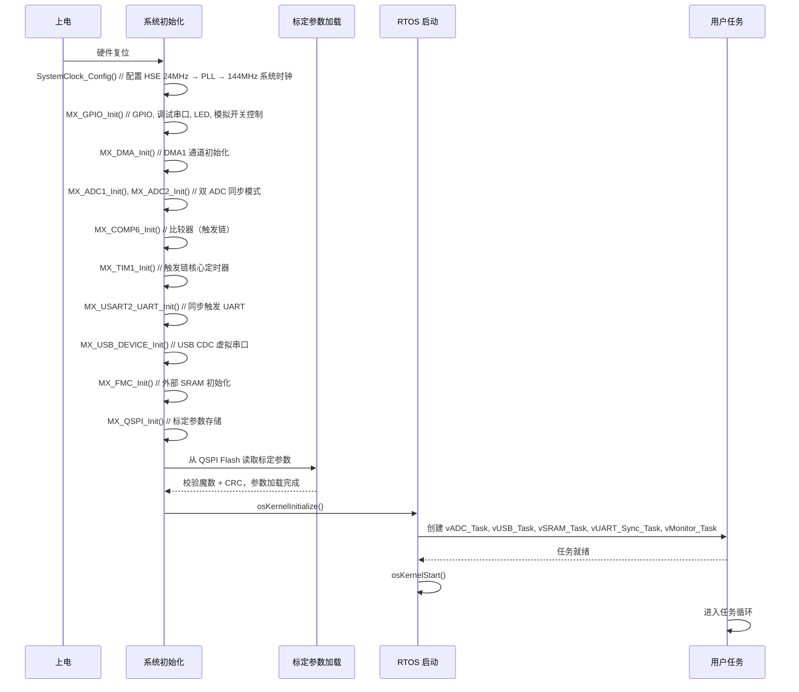

<!------------------------------------------------------------------------
SPDX-License-Identifier: CC-BY-SA-4.0
Copyright (C) 2026 [EERNINUO](https://github.com/EERNINUO)

This work is licensed under the Creative Commons Attribution-ShareAlike 4.0 International License. 
To view a copy of this license, visit http://creativecommons.org/licenses/by-sa/4.0/.
------------------------------------------------------------------------->

<!-- Assisted-by: DeepSeek - 文档框架 -->

# E4 – 4通道应变信号采集模块软件设计文档

| 文档编号 | E4-SDD-001 | 版本 | V1.0  |
| --------| ---------- | ---- | ----- |
| 项目名称 | 课程设计 E4 应变采集 | 日期 | 2026-06-04 |
| 起草人 | EERNINUO | 状态 | 设计中 |

## 1. 软件总体架构

### 1.1 设计思路
本模块软件基于 **FreeRTOS** 实时操作系统，充分利用 STM32G473 的多任务处理能力及硬件外设，实现以下功能：

- **4 通道 ADC 同步采集**：使用 MCU 的 2 个独立 ADC 模块（ADC1, ADC2），将 4 路应变信号按通道配对分配：**ADC1 负责 CH1 和 CH4，ADC2 负责 CH2 和 CH3**（具体 ADC 输入引脚号需根据原理图确认，见 §2.2），配置为 **双 ADC 同步模式**（dual regular simultaneous mode），由 TIM1 的 TRGO 硬件触发信号同步启动转换，DMA 循环搬运数据至缓冲区。
- **硬件触发链**：外部触发信号经模拟开关（ADG704）选择后送入 MCU **内置比较器（CMP）** 整形，比较器输出直接路由至定时器（TIM1）的从模式触发输入（slave mode trigger），定时器产生 TRGO 信号同步启动 ADC1+ADC2 转换。**全程硬件链路，无需 CPU 中断干预启动**，触发响应延迟 < 1μs。
- **数据缓存与上传**：
  - 采集数据通过 **USB 虚拟串口（CDC）** 实时上传至 PC（SCPI 协议简化版）。
  - 高速采集数据暂存于 **外部 SRAM（IS61WV204816BLL，FMC 接口，4MB）**，支持"采集→缓存→批量上传"模式，突破 MCU 内部 RAM（128KB）限制。
- **系统配置与标定**：QSPI Flash（GD25Q32JV，32Mbit）中存储通道增益系数、偏置校准值及程序代码（支持 XIP 执行），上电时读取并应用于采集数据。
- **多机同步**：通过开漏缓冲器（74LVC1G07）线与的 UART 总线实现多模块同步触发信号共享，任一模块发出触发命令均可同步启动所有模块采集。

### 1.2 FreeRTOS 任务设计

| 任务名称 | 优先级 | 栈大小 (字) | 功能描述 | 触发方式 |
|----------|--------|-------------|----------|----------|
| `vADC_Task` | 最高 (3) | 512 | 初始化 ADC 触发链（CMP→TIM→ADC），等待 DMA 半满/全满中断信号量，对原始 ADC 数据做增益/偏置校正后打包为 `adc_data_t` 发送至队列 | 二值信号量（来自 DMA 传输完成中断回调） |
| `vUSB_Task` | 中等 (2) | 512 | 从队列接收数据，通过 USB CDC 发送至 PC | 队列消息（队列非空） |
| `vSRAM_Task` | 中等 (2) | 512 | 从队列接收数据，写入外部 SRAM（FMC 接口）环形缓冲区；在"批量上传"模式下将 SRAM 中的数据经 USB 上传 | 队列消息 + 缓存水位标志 |
| `vUART_Sync_Task` | 较高 (3) | 256 | 监听 UART 总线上的同步触发帧；收到外部同步帧时向本地触发链发出启动信号；本地产生触发时向总线广播同步帧 | UART RX 中断 + 软件事件标志 |
| `vMonitor_Task` | 最低 (1) | 256 | 监控系统状态（LED 闪烁、队列水位、SRAM 缓存占用、错误标志） | 软件定时器（每 500ms） |

> **注**：队列传递的数据结构为 `struct adc_data_t`，包含 4 通道原始值（uint16_t[4]）、时间戳（uint32_t，来自 TIM 计数器）、触发序号（uint32_t）、采集模式标志（uint8_t）。

### 1.3 系统流程图（Mermaid）

```mermaid
graph TD
    A[系统上电] --> B[硬件初始化: 时钟, GPIO, ADC, DMA, USB, FMC-SRAM, QSPI, CMP, TIM]
    B --> C[读取 QSPI Flash 标定参数]
    C --> D[创建 FreeRTOS 队列与信号量]
    D --> E[创建 vADC_Task, vUSB_Task, vSRAM_Task, vUART_Sync_Task, vMonitor_Task]
    E --> F[启动 FreeRTOS 调度器]

    subgraph 硬件触发链
        T0[外部触发信号] --> T1[模拟开关 ADG704 选源]
        T1 --> T2[CMP 比较器整形]
        T2 --> T3[TIM1 从模式触发输入]
        T3 --> T4[TIM1 TRGO]
        T4 --> T5[ADC1+ADC2 同步转换]
        T5 --> T6[DMA 搬运至缓冲区]
        T6 --> T7[DMA 传输完成中断]
    end

    subgraph vADC_Task
        F1[等待 DMA 中断信号量] --> F2[读取 ADC1/ADC2 DMA 缓冲区]
        F2 --> F3[增益/偏置校正 → 组合4通道数据]
        F3 --> F4[封装 adc_data_t 发送至队列]
        F4 --> F1
    end

    subgraph vUSB_Task
        U1[等待队列消息] --> U2[获取 adc_data_t]
        U2 --> U3[格式化字符串(SCPI 风格)]
        U3 --> U4[USB CDC 发送]
        U4 --> U1
    end

    subgraph vSRAM_Task
        S1[等待队列消息] --> S2[写入 FMC SRAM 环形缓冲区]
        S2 --> S3{缓存水位 ≥ 阈值?}
        S3 -- 是 --> S4[触发"批量上传"模式：从 SRAM 读取数据经 USB 发送]
        S4 --> S1
        S3 -- 否 --> S1
    end

    subgraph vUART_Sync_Task
        Y1[等待 UART RX 中断事件] --> Y2{判断帧类型}
        Y2 -- 同步触发帧 --> Y3[向本地触发链发出触发信号]
        Y3 --> Y1
        Y2 -- 其他命令 --> Y4[解析并执行]
        Y4 --> Y1
    end

    subgraph vMonitor_Task
        M1[延时 500ms] --> M2[翻转 LED]
        M2 --> M3[检查队列溢出/SRAM 缓存满/任务挂起]
        M3 --> M1
    end
```

## 2. CubeMX 配置要点

> 以下配置基于 **STM32CubeMX 6.12** 及 **STM32G473VE**。

### 2.1 时钟树配置

| 参数 | 值 | 说明 |
|------|-----|------|
| HSE | 24 MHz (外部晶振) | 硬件设计文档指定 24MHz，10pF 负载电容 |
| PLL 源 | HSE |  |
| PLLM | 2 | 分频至 12MHz (24/2) |
| PLLN | 24 | 倍频至 288MHz (12×24) |
| PLLP | 2 | 主 PLL 分频（系统时钟 = 288/2 = 144MHz） |
| PLLQ | 6 | USB 分频：288/6 = 48MHz |
| 系统时钟 (SYSCLK) | 144 MHz | 最大 170MHz，留余量 |
| AHB 预分频 (HCLK) | /1 | 144 MHz |
| APB1 (PCLK1, 含定时器) | /1 → 144 MHz | G4 的 APB1 最高支持 170MHz，144MHz 无需分频 |
| APB2 (PCLK2, 含 ADC) | /1 → 144 MHz | ADC 内核时钟由 APB2 经 ADC 内部预分频器得到 |


### 2.2 ADC 配置（双 ADC 同步规则模式 + 双重交错模式）

STM32G473 内部集成 **5 个独立 ADC**，本设计使用其中的 **ADC1 和 ADC2** 实现 4 通道同步差分采集。

**通道分配**：

- **ADC1**：负责 **CH1 和 CH4**（各为一组差分对）
- **ADC2**：负责 **CH2 和 CH3**（各为一组差分对）

| 参数 | ADC1 | ADC2 | 说明 |
|------|------|------|------|
| 模式 | **双 ADC 常规同步模式** (Dual regular simultaneous mode) | 同一 TRGO 信号同步触发 |
| 分辨率 | 12 位 | 12 位 |  |
| 数据对齐 | 右对齐 | 右对齐 |  |
| 扫描方向 | 使能扫描 | 使能扫描 | 每个 ADC 依次转换 2 个通道 |
| 差分通道 | CH1(IN6+/IN6-), CH4(IN11+/IN11-) | CH2(IN8+/IN8-), CH3(IN1+/IN1-) | - |
| 采样时间 | 12.5 个 ADC 时钟周期 | 12.5 个 ADC 时钟周期 | 适应 ≤ 200kHz 信号带宽 |
| 触发源 | **TIM1_TRGO** | **TIM1_TRGO** | **同一 TRGO 信号同步触发** |
| DMA 请求 | 使能 (循环模式) | 使能 (循环模式) | 搬运至独立缓冲区 |

> **关键点**：
> - ADC1 和 ADC2 在 CubeMX 中配置为 **"Dual regular simultaneous mode"**（在 ADC1 的 Parameter Settings → ADC_Regular_Sequence → Mode 中选择）。
> - 每次 TIM1_TRGO 触发后，两个 ADC **同时**启动各自通道的规则序列转换。
> - DMA 将结果分别搬运至 `adc1_buf[2]`（存放 CH1, CH4 原始值）和 `adc2_buf[2]`（存放 CH2, CH3 原始值）。
> - DMA 传输完成中断中释放信号量，通知 vADC_Task 处理数据。


### 2.3 DMA 配置

| 通道 | 外设 | 方向 | 数据宽度 | 模式 | 优先级 | 缓冲区大小 |
|------|------|------|----------|------|--------|-----------|
| DMA1_Channel1 | ADC1 | 外设到内存 | Half Word (16-bit) | 循环 | 高 | `adc1_buf[2]` (2×16bit × N 缓冲区) |
| DMA1_Channel2 | ADC2 | 外设到内存 | Half Word (16-bit) | 循环 | 高 | `adc2_buf[2]` (2×16bit × N 缓冲区) |

> **双缓冲设计**：
> - 建议使用 **DMA 双缓冲区模式** (Double Buffer Mode，由 CubeMX 的 DMA Transfer Mode 中勾选) 或使用 **DMA 半满/全满中断** 实现 ping-pong 缓冲。
> - 缓冲区大小建议设为 256~512 个采样点（每通道），即 `adc1_buf[2][512]`、`adc2_buf[2][512]`，配合 DMA 循环模式使用。
> - **中断处理原则**：DMA 中断 ISR 中**只做信号量释放**，不做数据处理（遵循 FreeRTOS 中断安全规范），实际数据组合在 vADC_Task 中完成。

### 2.4 定时器 TIM1 配置（触发源与硬件触发链）

TIM1 在本设计中扮演 **触发链核心** 角色：接收 CMP 比较器输出作为从模式触发输入，产生 TRGO 信号同时启动 ADC1+ADC2 同步转换。

**完整触发链路（全硬件链路，无 CPU 干预启动延迟）：**

```
外部 SMA → 模拟开关 ADG704(选择通道) → COMP6(内置比较器，整形) → TIM1 从模式触发输入(TI1_FP1 或 TI2_FP2)
    → TIM1 TRGO (UEV) → ADC1+ADC2 同步转换 → DMA 搬运 → DMA 完成中断(释放信号量→通知 vADC_Task)
```

**CMP 比较器配置要点**（需在 CubeMX 的 Analog → COMP6 中配置）：

| 参数 | 值 | 说明 |
|------|-----|------|
| 模式 | 比较器模式 | 输入：外部触发信号（经模拟开关选择），参考：内部 DAC 或外部 Vref |
| 正输入 (INP) | GPIO（连接 ADG704 输出引脚） | 需根据原理图确认具体 GPIO |
| 负输入 (INM) | VREFINT (内部参考) 或 DAC1_OUT | 用于设置触发电平阈值 |
| 输出极性 | 不反向 |  |
| 迟滞 | 无或小迟滞 | 根据触发信号质量调整 |
| 输出重定向 | **TIM1 输入捕获通道** | 连接至 TIM1 的 TI1 (ITR) 或 TI2，使 TIM1 能从模式触发 |
| BLG 输出 | 使能 | 产生中断标志（可选，用于调试） |

**TIM1 定时器配置：**

| 参数 | 值 | 说明 |
|------|-----|------|
| 时钟源 | 内部时钟 (144MHz, PCLK1) | APB1 = 144MHz（不分频），定时器使用 PCLK1 直接作为计数时钟 |
| 从模式 | **触发模式 (Trigger mode)** | CMP 输出作为触发源 |
| 触发源选择 | **ITR0 → COMP6_OUT** | STM32G473 中 COMP6_OUT 内部连接到 TIM1 的 ITR0，具体见 RM0440 Table |
| 主模式输出 (TRGO) | **更新事件 (UEV)** | 连接到 ADC 的触发输入 |
| 预分频器 (PSC) | 144-1 | 计数时钟降至 1MHz（用于周期性模式时） |
| 自动重载 (ARR) | 可变（如 10000） | 周期性模式下产生 100Hz 触发 |
| 计数器模式 | 向上计数 |  |
| 自动重载预装载 | 使能 |  |

> **关于两种采集模式的软件切换**：
>
> | 模式 | TIM1 从模式配置 | 触发源 | 适用场景 |
> |------|---------------|--------|----------|
> | **外部触发模式**（默认） | 触发模式 (SMS=110)，等待 CMP 输入 | CMP 输出（外部信号） | 瞬态信号捕捉、多机同步 |
> | **周期性采集模式** | 关闭从模式 (SMS=000)，使用内部计数 | 内部 UEV 自动触发 | 连续监测、无外部触发源 |
>
> 切换方式：操作 `TIM1->SMCR` 寄存器的 SMS 位域，以及 `TIM1->CR1` 的 CEN 位。建议在 vUART_Sync_Task 中根据接收到的命令（如 `:TRIG:SOURCE EXT` 或 `:TRIG:SOURCE INT`）进行切换。


### 2.5 USB 外设配置

| 参数 | 值 | 说明 |
|------|-----|------|
| 设备模式 | Communication Device Class (CDC) | 虚拟串口 |
| 端点 | EP1 IN (64 bytes), EP2 OUT (64 bytes) | 中断传输 |
| 时钟 | 48 MHz (从 PLLQ 输出) | 必须精确 |
| 缓冲区 | 用户定义 |  |


### 2.6 QSPI 配置（标定参数存储）

| 参数 | 值 | 说明 |
|------|-----|------|
| 模式 | **QSPI (4 线)** | 硬件设计使用 GD25Q32JV，支持四线模式，可用于 XIP（就地执行） |
| 时钟分频 | 144 MHz / 2 = **72 MHz** | 满足 GD25Q32JV 要求（最大 104MHz） |
| 片选 (NCS) | 硬件控制 | CubeMX 中勾选 "Hardware NCS" |
| DMA | 不使能 | 标定参数读写次数少，无需 DMA |

> **存储规划**（QSPI Flash 地址映射）：
> | 地址范围 | 内容 | 大小 |
> |----------|------|------|
> | 0x0000 - 0x03FF | 标定参数头（魔数 4B + 版本 4B + 通道数 4B + 校验和 4B） | 16 B |
> | 0x0400 - 0x07FF | CH1 增益 (float) + 零偏 (int16) + 保留 | 8 B |
> | 0x0800 - 0x0BFF | CH2 增益 (float) + 零偏 (int16) + 保留 | 8 B |
> | 0x0C00 - 0x0FFF | CH3 增益 (float) + 零偏 (int16) + 保留 | 8 B |
> | 0x1000 - 0x13FF | CH4 增益 (float) + 零偏 (int16) + 保留 | 8 B |
> | 0x1400 - ... | 程序代码（XIP 执行） | 剩余空间 |
>
> 上电后读标定参数的伪代码逻辑：`read_qspi(0x0000, &header, 16)` → 验证魔数 `0xE4C101DA` → 验证 CRC32 → 若通过则加载增益/偏置，否则使用默认值（gain=1.0, offset=0）。

### 2.7 FMC 配置（外部 SRAM）

| 参数 | 值 | 说明 |
|------|-----|------|
| 芯片型号 | IS61WV204816BLL | 2M×16bit = 4MB，异步 SRAM |
| FMC 片选 | NE1 / NE2 | 根据 PCB 连线选择 |
| 数据宽度 | 16 位 |  |
| 地址线 | A0-A20 (21 位) |  |
| 操作模式 | **异步模式 A** (Asynchronous mode 1) | G4 FMC 仅支持 SRAM 异步模式 |
| 时序参数 | （见下方详细说明） | |

**STM32G473 FMC 时序参数说明**（与 F4/H7 不同，G4 系列简化版 FMC 只有 4 个时序参数）：

| CubeMX 参数名 | 建议值 | 说明 |
|---------------|--------|------|
| **Address setup time** (ADDSET) | `2` | 地址建立时间（HCLK 周期数）。对应 IS61WV204816BLL 的 tSA（地址建立到片选/写使能时间），典型值 10ns |
| **Data setup time** (DATAST) | `3` | 数据建立时间（HCLK 周期数）。对应 IS61WV204816BLL 的 tRC（读周期时间）和 tWC（写周期时间），典型值 10ns |
| **Data hold time** (DATAHLD) | `1` | 数据保持时间（HCLK 周期数）。对应 IS61WV204816BLL 的 tOH（输出保持时间），典型值 3ns |
| **Bus turn around time** (BUSTURN) | `1` | 总线周转时间（HCLK 周期数）。读→写切换时的等待时间 |

> **时序裕量验算**（HCLK=144MHz → 1 周期 ≈ 6.94ns）：
> - 地址建立时间：2 × 6.94ns = **13.9ns** > IS61WV204816BLL 的 tSA（典型 10ns） ✅
> - 数据建立时间：3 × 6.94ns = **20.8ns** > IS61WV204816BLL 的 tRC（典型 10ns） ✅ 裕量充足
> - 如需更高性能，可尝试 ADDSET=1, DATAST=2（但建议先以上面保守值验证硬件正常后，再逐步降低）

**CubeMX 操作步骤**：
1. Pinout & Configuration → Connectivity → FMC → 在 "FMC 1" 中勾选对应的 **NE** 片选引脚
2. **Mode** → 选 "NOR/PSRAM/SRAM" 或 "SRAM"（取决于 CubeMX 版本）
3. **Parameter Settings**：
   - Bus Type: **SRAM**
   - Data Width: **16 bit**
   - Address Setup Time (ADDSET): **2** (HCLK cycles)
   - Data Setup Time (DATAST): **3** (HCLK cycles)
   - Data Hold Time (DATAHLD): **1** (HCLK cycles)
   - Bus Turnaround Time (BUSTURN): **1** (HCLK cycles)

> **⚠️ 注意**：STM32G473 的 FMC 不支持地址保持时间 ("Address hold time") 这个参数，这是和 F4/H7 系列的区别。G4 的 FMC 是简化版，只有 ADDSET、DATAST、DATAHLD、BUSTURN 四项。


### 2.8 UART 配置（多机同步触发）

| 参数 | 值 | 说明 |
|------|-----|------|
| 外设 | USART2 | UART 总线通过 74LVC1G07 开漏缓冲器线与 |
| 波特率 | 115200 bps | 或 1Mbps（同步触发帧极短，推荐更高波特率降低延迟） |
| 数据位 | 8 |  |
| 校验 | 无 |  |
| 停止位 | 1 |  |
| 模式 | **半双工** (单线) | 硬件线路为开漏线与总线，TX/RX 共用一线 |
| 中断 | 使能 RXNE 中断 | 收到数据即触发中断，vUART_Sync_Task 中解析帧内容 |

> **同步触发帧协议**（由 vUART_Sync_Task 处理）：
> | 字节 0 | 字节 1 | 说明 |
> |--------|--------|------|
> | 0xE4 | 0x01 | **同步触发帧**：收到后立即启动本地采集 |
> | 0xE4 | 0x02 | **同步停止帧**：停止采集 |
> | 0xE4 | 0xFF | **保活/心跳帧**：用于同步校准时间基准 |


### 2.9 FreeRTOS 配置

| 参数 | 值 | 说明 |
|------|-----|------|
| RTOS 版本 | CMSIS-RTOS V2 | CubeMX 默认 |
| 任务默认栈大小 | 256 words | 根据实际调整 |
| 总堆大小 | 16384 bytes | 考虑到队列、信号量、任务栈，建议增大至 16KB |
| 时基源 (TIM) | SysTick | 1ms 中断，但 FreeRTOS 建议使用专用的 TIM6 或 TIM7 作为时基（避免与 HAL 冲突） |
| 支持动态创建任务 | 是 |  |
| 使用队列、信号量 | 是 |  |

> **关于时基源**：CubeMX 生成的 FreeRTOS 默认使用 SysTick 作为时基。如果 HAL_Delay() 也使用 SysTick，建议在 FreeRTOSConfig.h 中将 `configUSE_TICKLESS_IDLE` 设为 0，或将 FreeRTOS 时基切换到 TIM6（在 CubeMX 的 "Pinout & Configuration → System Core → FreeRTOS → Config Parameters → configTICK_SOURCE" 中可选择）。


### 2.10 GPIO 使用情况


## 3. 关键数据结构与算法

### 3.1 关键数据结构定义

**ADC 原始数据缓冲区**（每个 ADC 一个）：

```c
#define ADC_BUF_LEN      256     // 每通道环形缓冲区深度
#define ADC_CH_PER_ADC   2       // 每个 ADC 负责 2 个通道

// ADC1 缓冲区：存储 CH1, CH4 原始值
__attribute__((section(".sram_data"))) uint16_t adc1_buf[ADC_BUF_LEN][ADC_CH_PER_ADC];
// ADC2 缓冲区：存储 CH2, CH3 原始值
__attribute__((section(".sram_data"))) uint16_t adc2_buf[ADC_BUF_LEN][ADC_CH_PER_ADC];
```

**队列传递的数据结构**：

```c
typedef struct {
    uint16_t    ch[4];           // 4 通道 ADC 原始值 (12-bit, 右对齐)
    uint32_t    timestamp;       // 时间戳（来自 TIM1 计数器值，单位：1/144MHz ≈ 6.94ns，PSC=0 时）
    uint32_t    trigger_seq;     // 全局触发序号（上电后递增）
    uint8_t     mode_flags;      // Bit 0: 0=外部触发, 1=内部周期; Bit 1: 0=实时, 1=批量上传
    uint8_t     reserved[3];     // 对齐填充
} __attribute__((packed)) adc_data_t;
// 合计 4×2 + 4 + 4 + 1 + 3 = 16 字节
```

**标定参数结构**（存储在 QSPI Flash）：

```c
typedef struct {
    uint32_t    magic;           // 魔数 0xE4C101DA
    uint32_t    version;         // 标定数据版本
    uint32_t    num_channels;    // 通道数 (应=4)
    uint32_t    crc32;           // 校验和
    float       gain[4];         // 增益系数
    int16_t     offset[4];       // 零偏 (LSB)
    uint16_t    reserved[4];     // 保留
} __attribute__((packed)) calibration_t;
```

### 3.2 数据流与处理逻辑

**完整数据流**：

```
外部触发信号 → CMP整形 → TIM1从模式触发 → ADC1+ADC2同步转换
    → DMA循环搬运至 adc1_buf / adc2_buf
    → DMA传输完成中断 → xSemaphoreGiveFromISR → 唤醒 vADC_Task
    → vADC_Task 读取缓冲区，增益/偏置校正，封装 adc_data_t
    → xQueueSend → 消费端：
        → vUSB_Task: 格式化并 USB CDC 发送至 PC
        → vSRAM_Task: 写入外部 SRAM（批量上传模式使用）
```

**增益偏置校正公式**：

```
V_ch = ((adc_raw * V_REF) / 4096.0f - offset[ch]) * gain[ch]
```

其中：
- `adc_raw`：ADC 原始读数 (0~4095)
- `V_REF`：ADC 参考电压 = 2.5V（由电源设计中的 2.5V 激励电源提供）
- `offset[ch]`：该通道零偏（单位：伏特，通过短接输入端测量获得）
- `gain[ch]`：该通道增益系数（无量纲，通过输入标准电压标定获得）

> 由于硬件前端有 4 倍放大 + 1/4 衰减的组合，软件层面的 gain 校正主要补偿器件离散性误差，而非做满量程缩放。

### 3.3 SCPI 命令集定义（USB CDC 通信协议）

PC 通过 USB 虚拟串口发送 SCPI 风格命令控制采集模块，模块响应以 `\n` 结尾。

| 命令 | 功能 | 响应示例 |
|------|------|----------|
| `*IDN?` | 查询设备信息 | `E4-Strain, V1.0, SN:xxxx\n` |
| `:ACQuire:STARt` | 启动采集 | `OK\n` |
| `:ACQuire:STOP` | 停止采集 | `OK\n` |
| `:TRIGger:SOURce EXT` | 设为外部触发模式 | `OK\n` |
| `:TRIGger:SOURce INT` | 设为内部周期性触发 | `OK\n` |
| `:TRIGger:INTerval <Hz>` | 设置内部触发频率 | `OK\n` |
| `:TRIGger:CHANnel <1-4>` | 选择触发源通道 | `OK\n` |
| `:CALibration:LOAD` | 从 QSPI 加载标定参数 | `OK\n` 或 `ERR:CRC\n` |
| `:CALibration:SAVE` | 保存当前标定参数到 QSPI | `OK\n` |
| `:FETCh?` | 查询单次最新采集数据 | `CH1:1.234,CH2:2.345,CH3:0.567,CH4:1.890\n` |
| `:UPLoad:STARt` | 启动批量上传（从 SRAM 读取） | `OK\n` 后持续发送数据包 |
| `:UPLoad:STOP` | 停止批量上传 | `OK\n` |
| `:SYSTem:ERRor?` | 查询错误状态 | `OK,0\n` 或 `ERR:code,msg\n` |


### 3.4 触发响应机制
处理过程：

1. **外部信号到来** → SMA 接口输入
2. **模拟开关 (ADG704)** → 选择触发源通道（由 GPIO SEL0, SEL1 控制）
3. **CMP 比较器** → 整形，输出至 TIM1
4. **TIM1 从模式** → 收到触发后产生 UEV，输出 TRGO
5. **ADC1+ADC2** → 同步开始转换
6. **DMA** → 循环搬运 ADC 结果至缓冲区
7. **DMA 传输完成中断** → `xSemaphoreGiveFromISR()` 释放信号量
8. **vADC_Task** → 获取信号量，处理数据

**周期性采集模式**：软件设置 `TIM1->SMCR` 的 SMS=0（关闭从模式），TIM1 按 ARR 频率自由运行，自动产生 UEV→TRGO 触发 ADC。

## 4. 系统启动流程



## 5. 测试与调试方法

### 5.1 单元测试计划

| 模块 | 测试内容 | 测试工具 | 通过标准 |
|------|----------|----------|----------|
| 电源上电 | 各电压轨空载/负载电压纹波 | 万用表 + 示波器 | 3.3V±3%, ±4V±5%, 2.5V±1%, 纹波 < 50mVpp |
| MCU 最小系统 | SWD 连接、LED 闪烁 | ST-Link + CubeIDE | 正常识别芯片，LED 以 1Hz 闪烁 |
| FMC SRAM 读写 | 写 0x55AA/0xAA55 模式并回读 | 串口打印 | 数据正确，无 Bit 错误 |
| QSPI Flash 读写 | 写入 4KB 标定数据并回读 | 串口打印 | 数据完全一致，CRC 校验通过 |
| USB CDC 枚举 | PC 端识别为虚拟串口 | 设备管理器 | 成功出现 COM 端口 |
| CMP 比较器 | 输入三角波，观察输出翻转 | 信号发生器 + 示波器测 GPIO | 翻转阈值与设定值一致 |
| 触发链（全链路） | SMA 输入脉冲，测 ADC 转换完成 | 脉冲发生器 + 逻辑分析仪 | 触发到 ADC 数据就绪 < 2μs |
| ADC + DMA 循环 | 连续采集 10kHz 正弦波 | 信号发生器 + PC 端 Python 绘图 | 波形无明显失真，FFT 主峰正确 |
| USB 连续传输 | 持续发送 10000 包数据 (每包 4 通道) | PC 串口助手 | 无丢包，数据顺序正确 |
| 周期性采集模式 | 设置内部触发 1kHz，测实际频率 | 示波器测 DAC 或 GPIO 输出 | 频率误差 < 1% |
| 多机同步 (如有条件) | 2 块模块同步触发，对比采集起始时刻 | 同一信号源 + 双模块同时采集 | 两模块数据对齐，时差 < 1μs |
| SCPI 命令解析 | 逐条测试 §3.3 中定义的命令 | 串口助手手动输入 | 命令均有正确响应 |

### 5.2 调试接口

| 接口 | 用途 | 工具 | 说明 |
|------|------|------|------|
| SWD | 在线调试、断点、变量观察 | ST-Link + CubeIDE / Ozone | 可观察任务栈使用率、队列消息数 |
| USART1 (调试串口) | 调试日志输出 | 串口助手 (115200 8N1) | `printf` 重定向至此端口 |
| USB CDC (虚拟串口) | 数据上传 + SCPI 命令 | PC 端 Python 脚本 / 串口助手 | 数据通信主通道 |
| GPIO (测试点) | 示波器测量关键时序 | 示波器 | 可在 ISR 入口/出口翻转 GPIO 测量延迟 |

### 5.3 常见问题排查

| 现象 | 可能原因 | 排查方法 |
|------|----------|----------|
| USB 无法枚举 | USB DP/DM 差分阻抗不匹配、时钟不准 | 检查 PCB 走线 90Ω 阻抗，测量 48MHz USB 时钟 |
| ADC 数据全为 0 | ADC 未使能、触发源未连接、差分输入共模超出范围 | 用示波器测 ADC 输入引脚，检查 CubeMX ADC 配置 |
| DMA 数据错位 | 缓冲区大小不匹配、DMA 未正确配置循环模式 | 减少缓冲区大小调试，检查 DMA 地址递增设置 |
| 触发响应无反应 | CMP 阈值设置不当、TIM1 从模式配置错误 | 用示波器测 CMP 输出引脚，逐级排查触发链 |
| SRAM 数据读写错误 | FMC 时序参数不匹配、地址线错位 | 降低 FMC 时钟（增加等待周期），验证地址线连续性 |

## 6. 附录：软件-硬件接口对照表

下表列出了软件文档中涉及的硬件资源，以及对应的硬件文档章节，供设计时对照参考。

| 软件模块 | 硬件资源 | 硬件文档章节 | 关键引脚/参数 |
|----------|----------|-------------|--------------|
| ADC1 + ADC2 | STM32G473 内置 ADC | §2.2 MCU 最小系统 | 4 路差分输入（引脚号需确认） |
| 触发源选择 | ADG704 模拟开关 | §2.2.4 电平触发 | SEL0, SEL1 → GPIO |
| CMP 比较器 | STM32G473 内置 COMP6 | §2.2.4 电平触发 | 输入连接 ADG704 输出 |
| TIM1 | STM32G473 内置 TIM1 | §2.2 MCU | TRGO → ADC |
| USB CDC | USB Type-A + PRTR5V0U2X | §2.3 USB 接口 | DP/DM 90Ω 差分对 |
| FMC SRAM | IS61WV204816BLL | §2.5.2 SRAM | A0-A20, D0-D15, WE, OE, CE |
| QSPI Flash | GD25Q32JV | §2.5.1 QSPI Flash | 四线模式，72MHz |
| 多机同步 UART | 74LVC1G07 开漏缓冲 | §2.4部触发输入 | 半双工 UART bus |
| 电源系统 | TPS7A4701, SGM2059 等 | §2.6 电源与去耦 | 2.5V(ADC ref), 3.3V_A, 3.3V_D, ±4V |
| 调试 SWD | SWD 4-pin 接口 | §2.2 MCU 最小系统 | SWCLK, SWDIO, NRST |

## 8. 版本记录

| 版本 | 日期 | 修改内容 | 修改人 |
|------|------|----------|--------|
| V1.0 | 2026-06-04 | 初始版本 | EERNINUO |
| V1.1 | 2026-06-04 | 细化与修正：<br>• 修正时钟树计算（24MHz→PLL 系数）<br>• 补充 FMC/UART/CMP 配置章节<br>• 修正触发链描述（硬件链路不含 CPU 中断）<br>• 修正数据流（去除不存在的 SD 卡）<br>• 增加 SCPI 命令集定义<br>• 增加数据结构定义<br>• 增加软件-硬件接口对照表<br>• 增加需手动补充事项清单 | EERNINUO |